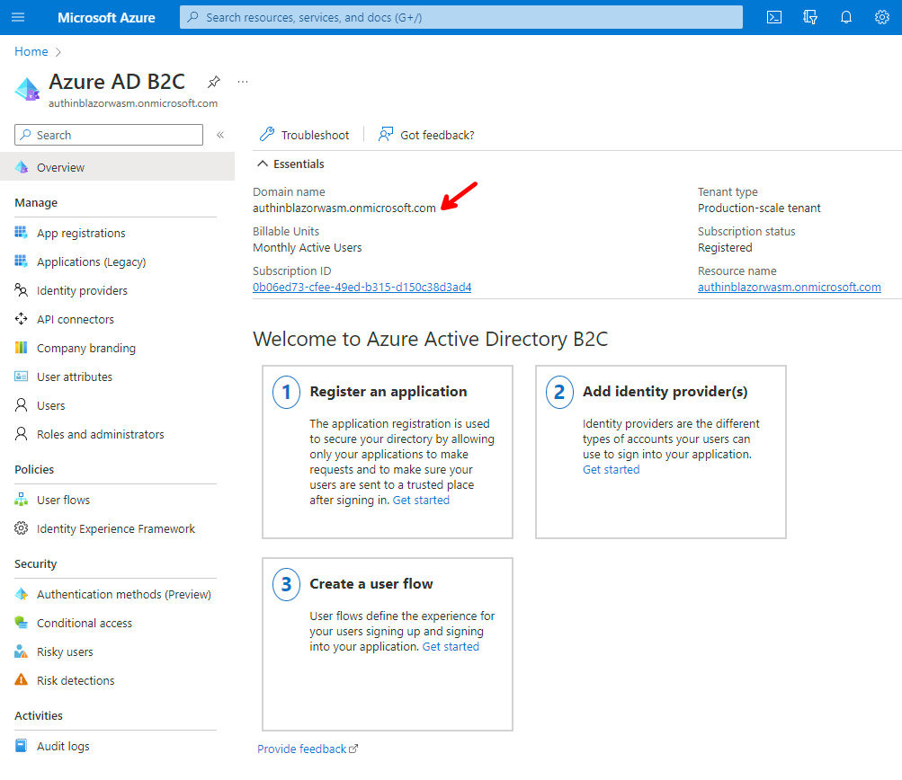
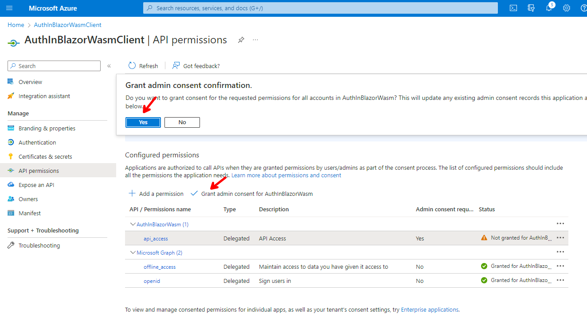
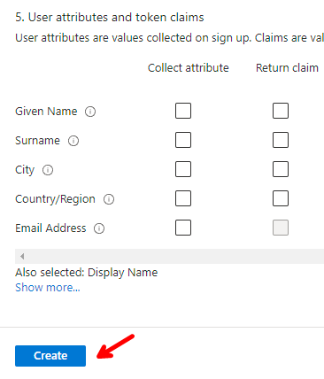

# Securing a Blazor Hosted WebAssembly app using MSAL and Azure AD B2C (.NET 7)

In this episode, we are going to create an **Azure AD B2C** tenant and configure it for email authentication. We are going to create a new **Blazor WebAssembly** hosted application via the **.NET Core CLI**, which comes pre-loaded with everything you'll need to do auth with MSAL.

For a similar demo but using **Blazor Server** and **Msal.Net** in .NET 6, consider watching the following episode.

| Episode                    | YouTube URL                                   | GitHub Repo URL                                    |
| -------------------------- | --------------------------------------------- | -------------------------------------------------- |
| MSAL Auth in Blazor Server | <https://www.youtube.com/watch?v=AlRxwIOq4jQ> | <https://github.com/carlfranklin/msalauthinblazor> |

The steps in this README and subsequent information was gleaned from the following documentation:

https://learn.microsoft.com/en-us/aspnet/core/blazor/security/webassembly/hosted-with-azure-active-directory-b2c?view=aspnetcore-7.0

## Prerequisites

The following prerequisites are needed for this demo.

### .NET 7.0

Download the latest version of the .NET 7.0 SDK [here](https://dotnet.microsoft.com/en-us/download/dotnet/7.0).

### Visual Studio 2022

For this demo, we are going to use the latest version of [Visual Studio 2022](https://visualstudio.microsoft.com/vs/community/).

### Required Workloads

For this demo, the required workload is needed.

#### ASP.NET and web development workload

In order to build Blazor apps, the ASP.NET and web development workload needs to be installed, so if you do not have that installed let's do that now.

  

### Azure Subscription

If you do not have an Azure subscription, go ahead and create one for free at [here](https://azure.microsoft.com/en-us/free/).

## Demo

In the following demo we will perform the following actions:

1. Create an **Azure AD B2C** Tenant
2. Configure the applications and user flow
3. Create a new **Blazor WebAssembly** hosted application using the .NET CLI

## Create a new Azure AD B2C Tenant

Sign in to **Azure** and go to the main menu, and click on **New resource**.

  

Enter **Azure Active Directory B2C** in the search box, and select **Azure Active Directory B2C**.

  

Click the **Create** button.

  

Select **Create a new Azure AD B2C Tenant.**

  

Enter the following:


Click on **Review + create** and you will be presented to the **Validation** screen.

  

Click on **Create**, and you will be presented to the **Progress** screen.


After a few minutes, you should be presented to the **Success** screen.

  

Click on the link provided to go to the **Tenant Overview** screen.

> :point_up: Take note of the **Domain name**, as we are going to need later.

  

>:blue_book: For more detailed instructions about creating **Azure AD B2C Tenant** follow this tutorial [Tutorial: Create an Azure Active Directory B2C tenant](https://learn.microsoft.com/en-us/azure/active-directory-b2c/tutorial-create-tenant) to create an **Azure AD B2C Tenant**.

## Register a Server API Application

Go to **App registrations** and click on **+ New registration**.

  

Enter the following settings and click on **Register**.

  

>:point_up: Take note of the **Application (client) ID**, as we are going to need later.

## Expose an API

Click on **Expose API** and then on **+ Add a scope**.

  

Enter the following values and then click on **Add scope**:

| Setting                    | Value                                                        |
| -------------------------- | ------------------------------------------------------------ |
| Scope name                 | api_access                                                   |
| Admin consent display name | API Access                                                   |
| Admin consent description  | Allows the Blazor application to access the server API endpoints. |

  

You will see the success message.

  

## Register a Client Application

### Using the Azure Portal

Click on **App registrations** on the top menu.

  

Then click on the **+ New registration** link.

  

Enter the following values and click on **Register**.

For the Redirect URI specify

```
https://localhost/authentication/login-callback
```


  

Then click on **API permissions**, **+ Add Permission**, and select **My APIs**, and click on **AuthInBlazorWasm**.

  

Then, make the following selections and enter the following value and click **Add permissions**.

  

Click on **Grant admin consent for AuthInBlazorWasm** and click **Yes**.

  

## Create User Flow

In the main **Search** box, enter **azure ad b2c** and select **Azure AD B2C**.


Click on **User flows** and then on **+ New User Flow**.

  

Make the following selections and click on **Create**.

  

Enter the following values:

  

Before clicking **Create**, scroll down until you see **Show more...**, click the link and the select **Display name** under **Collect attribute** and click **OK**.

  

Now you can click **Ok** to create the **User flow**.

  

>:blue_book: For more detailed instructions about creating **User Flows** follow this tutorial [Tutorial: Create user flows and custom policies in Azure Active Directory B2C](https://learn.microsoft.com/en-us/azure/active-directory-b2c/tutorial-create-user-flows?pivots=b2c-user-flow)

## Create the Blazor Wasm Application

Now we are ready to create our **Blazor Wasm** application, using all the settings we need and took note of in the steps above.

We are going to use the **.NET Core CLI** to create our **Blazor Wasm** application by entering the following command on your **Windows Terminal**:

```dotnetcli
dotnet new blazorwasm -au IndividualB2C --aad-b2c-instance "{AAD B2C INSTANCE}" --api-client-id "{SERVER API APP CLIENT ID}" --app-id-uri "{SERVER API APP ID URI}" --client-id "{CLIENT APP CLIENT ID}" --default-scope "{DEFAULT SCOPE}" --domain "{TENANT DOMAIN}" -ho -o {APP NAME} -ssp "{SIGN UP OR SIGN IN POLICY}"
```

>:point_up: We need to replace all the placeholders with the values we took note of in previous steps.

To make it easier, I compiled a summary of all the values we need to replace, and where to get them from, as well as examples of their values based on my current settings.

### Server app Settings

> :point_up: Make sure you add a trailing forward slash to the end of your AAD B2C INSTANCE URL

| Setting                    | Value                                      | Example                                |
| -------------------------- | ------------------------------------------ | -------------------------------------- |
| {AAD B2C INSTANCE}         | https://{TENANT_NAME}.b2clogin.com/        | https://authinblazorwasm.b2clogin.com/ |
| {SERVER API APP CLIENT ID} | Application (client) ID for the server app | dd2a1a86-9226-4b0a-bd5b-192381901b42   |
| {SERVER API APP ID URI}    | Application ID URI                         | dd2a1a86-9226-4b0a-bd5b-192381901b42   |

### Client app Settings

| Setting                | Value                                      | Example                              |
| ---------------------- | ------------------------------------------ | ------------------------------------ |
| {CLIENT APP CLIENT ID} | Application (client) ID for the client app | 9fa7bf36-ff95-4370-8ef0-0d3c23b414f5 |
| {SCOPE}                | Scope created in the client app            | api_access                           |

### Azure AD B2C Tenant Settings

| Setting                     | Value                           | Example                          |
| --------------------------- | ------------------------------- | -------------------------------- |
| {TENANT DOMAIN}             | Primary/Publisher/Tenant domain | authinblazorwasm.onmicrosoft.com |
| {SIGN UP OR SIGN IN POLICY} | Sign-up/sign-in user flow       | B2C_1_susi                       |

### General Settings

| Setting    | Value            | Example          |
| ---------- | ---------------- | ---------------- |
| {APP NAME} | Application name | AuthInBlazorWasm |

In my case, the command looked like this:

```dotnetcli
dotnet new blazorwasm -au IndividualB2C --aad-b2c-instance "https://authinblazorwasm.b2clogin.com/" --api-client-id "dd2a1a86-9226-4b0a-bd5b-192381901b42" --app-id-uri "dd2a1a86-9226-4b0a-bd5b-192381901b42" --client-id "9fa7bf36-ff95-4370-8ef0-0d3c23b414f5" --default-scope "api_access" --domain "authinblazorwasm.onmicrosoft.com" -ho -o AuthInBlazorWasm -ssp "B2C_1_susi"
```

The output location specified with the `-o|--output` option creates a project folder if it doesn't exist and becomes part of the app's name. 

> :warning: **Avoid using dashes (`-`) in the app name `{APP NAME}` that break the formation of the OIDC app identifier.** Logic in the Blazor WebAssembly project template uses the project name for an OIDC app identifier in the solution's configuration. Pascal case (`BlazorSample`) or underscores (`Blazor_Sample`) are acceptable alternatives. For more information, see [Dashes in a hosted Blazor WebAssembly project name break OIDC security (dotnet/aspnetcore #35337)](https://github.com/dotnet/aspnetcore/issues/35337).


## Run the Application

Now, the application has been created, and the **.NET Core CLI** helped us adding all the code, and proper *appsettings.json* values, for both, our **AuthInBlazorWasm.Client** and **AuthInBlazorWasm.Server** application, making sure that we do not expose sensitive information on the client side.

Run the **AuthInBlazorWasm.Server** application, which will be set up as the **Start-up application** by default, and you should see the following.


Click on the **Login** link on the top right, and you should be presented to the **Sign in/Sign up now** screen. Since we do not have an account yet to access the secured parts of the application (**Fetch Data**) go ahead and click on **Sign up now**


>:blue_book: **Fetch Data** is secured via the **[Authorize]** attribute in the **WeatherForecastController**, so if you try to go to **Fetch Data** without Logging in, you will be prompted to login first. The **Counter** page is not secured, so you will not get prompted to log in if you go to the **Counter** page.

Enter your email and click on **Send verification code**.


Go to your email, and get the verification code, and enter it in the appropriate box, and click on the **Verify code** button.


Enter a new password twice and your **Display name**, and click on **Create**.


Once you create your account, you will be able to go to the **Fetch Data** page successfully, and see the weather data.


## Check Created Account in Azure

To recap, at this point, we allowed a new user (this guy known as Carl Franklin) to create an account in our **Azure AD B2C** tenant, using our **Blazor Wasm** application, to access the secured and so important random **Weather Data**.

Go back to your **Azure AD B2C** tenant, and click on **Users**.

  

Here you will see, and be able to administer all aspects of the user.


Click on the user and you will see all the options available, such as resetting password, revoke sessions, etc.

  

> :point_up: The rest of this content is taken right from the documentation at https://learn.microsoft.com/en-us/aspnet/core/blazor/security/webassembly/hosted-with-azure-active-directory-b2c?view=aspnetcore-7.0

## **Server** app configuration

*This section pertains to the solution's **Server** app.*

### Authentication package

The support for authenticating and authorizing calls to ASP.NET Core web APIs with the Microsoft Identity Platform is provided by the [`Microsoft.Identity.Web`](https://www.nuget.org/packages/Microsoft.Identity.Web) package.

> :point_up: For guidance on adding packages to .NET apps, see the articles under *Install and manage packages* at [Package consumption workflow (NuGet documentation)](https://learn.microsoft.com/en-us/nuget/consume-packages/overview-and-workflow). Confirm correct package versions at [NuGet.org](https://www.nuget.org/).

The **Server** app of a hosted Blazor solution created from the Blazor WebAssembly template includes the [`Microsoft.Identity.Web.UI`](https://www.nuget.org/packages/Microsoft.Identity.Web) package by default. The package adds UI for user authentication in web apps and isn't used by the Blazor framework. If the **Server** app won't be used to authenticate users directly, it's safe to remove the package reference from the **Server** app's project file.

### Authentication service support

The `AddAuthentication` method sets up authentication services within the app and configures the JWT Bearer handler as the default authentication method. The [AddMicrosoftIdentityWebApi](https://learn.microsoft.com/en-us/dotnet/api/microsoft.identity.web.microsoftidentitywebapiauthenticationbuilderextensions.addmicrosoftidentitywebapi) method configures services to protect the web API with Microsoft Identity Platform v2.0. This method expects an `AzureAdB2C` section in the app's configuration with the necessary settings to initialize authentication options.

```csharp
builder.Services.AddAuthentication(JwtBearerDefaults.AuthenticationScheme)
    .AddMicrosoftIdentityWebApi(Configuration.GetSection("AzureAdB2C"));
```

> :point_up: When a single authentication scheme is registered, the authentication scheme is automatically used as the app's default scheme, and it isn't necessary to state the scheme to [AddAuthentication](https://learn.microsoft.com/en-us/dotnet/api/microsoft.extensions.dependencyinjection.authenticationservicecollectionextensions.addauthentication) or via [AuthenticationOptions](https://learn.microsoft.com/en-us/dotnet/api/microsoft.aspnetcore.authentication.authenticationoptions). For more information, see [Overview of ASP.NET Core Authentication](https://learn.microsoft.com/en-us/aspnet/core/security/authentication/?view=aspnetcore-7.0#defaultscheme) and the [ASP.NET Core announcement (aspnet/Announcements #490)](https://github.com/aspnet/Announcements/issues/490).

[UseAuthorization](https://learn.microsoft.com/en-us/dotnet/api/microsoft.aspnetcore.builder.authorizationappbuilderextensions.useauthorization) ensures that any request attempting to access a protected resource without proper credentials fails.

```csharp
app.UseAuthorization();
```

### User.Identity.Name

By default, the `User.Identity.Name` isn't populated.

To configure the app to receive the value from the `name` claim type:

- Add a namespace for [Microsoft.AspNetCore.Authentication.JwtBearer](https://learn.microsoft.com/en-us/dotnet/api/microsoft.aspnetcore.authentication.jwtbearer) to `Program.cs`:

  ```csharp
  using Microsoft.AspNetCore.Authentication.JwtBearer;
  ```

- Configure the [TokenValidationParameters.NameClaimType](https://learn.microsoft.com/en-us/dotnet/api/microsoft.identitymodel.tokens.tokenvalidationparameters.nameclaimtype#microsoft-identitymodel-tokens-tokenvalidationparameters-nameclaimtype) of the [JwtBearerOptions](https://learn.microsoft.com/en-us/dotnet/api/microsoft.aspnetcore.authentication.jwtbearer.jwtbeareroptions) in `Program.cs`:

  ```csharp
  builder.Services.Configure<JwtBearerOptions>(
      JwtBearerDefaults.AuthenticationScheme, options =>
      {
          options.TokenValidationParameters.NameClaimType = "name";
      });
  ```

### App settings

The `appsettings.json` file contains the options to configure the JWT bearer handler used to validate access tokens.

```json
"AzureAdB2C": {
  "Instance": "https://{TENANT NAME}.b2clogin.com/",
  "ClientId": "{SERVER API APP CLIENT ID}",
  "Domain": "{TENANT NAME}.onmicrosoft.com",
  "Scopes": "api_access",
  "SignUpSignInPolicyId": "B2C_1_susi"
},
```

Example:

```json
"AzureAdB2C": {
  "Instance": "https://authinblazorwasm.b2clogin.com/",
  "ClientId": "41451fa7-82d9-4673-8fa5-69eff5a761fd",
  "Domain": "authinblazorwasm.onmicrosoft.com",
  "Scopes": "api_access",
  "SignUpSignInPolicyId": "B2C_1_susi",
}
```

### WeatherForecast controller

The WeatherForecast controller (`Controllers/WeatherForecastController.cs`) exposes a protected API with the [`[Authorize\]` attribute](https://learn.microsoft.com/en-us/dotnet/api/microsoft.aspnetcore.authorization.authorizeattribute) applied to the controller. It's **important** to understand that:

- The [`[Authorize\]` attribute](https://learn.microsoft.com/en-us/dotnet/api/microsoft.aspnetcore.authorization.authorizeattribute) in this API controller is the only thing that protect this API from unauthorized access.
- The [`[Authorize\]` attribute](https://learn.microsoft.com/en-us/dotnet/api/microsoft.aspnetcore.authorization.authorizeattribute) used in the Blazor WebAssembly app only serves as a hint to the app that the user should be authorized for the app to work correctly.

```csharp
[Authorize]
[ApiController]
[Route("[controller]")]
public class WeatherForecastController : ControllerBase
{
    [HttpGet]
    public IEnumerable<WeatherForecast> Get()
    {
        ...
    }
}
```

## **Client** app configuration

*This section pertains to the solution's **Client** app.*

### Authentication package

When an app is created to use an Individual B2C Account (`IndividualB2C`), the app automatically receives a package reference for the [Microsoft Authentication Library](https://learn.microsoft.com/en-us/azure/active-directory/develop/msal-overview) ([`Microsoft.Authentication.WebAssembly.Msal`](https://www.nuget.org/packages/Microsoft.Authentication.WebAssembly.Msal)). The package provides a set of primitives that help the app authenticate users and obtain tokens to call protected APIs.

If adding authentication to an app, manually add the [`Microsoft.Authentication.WebAssembly.Msal`](https://www.nuget.org/packages/Microsoft.Authentication.WebAssembly.Msal) package to the app.

> :point_up: For guidance on adding packages to .NET apps, see the articles under *Install and manage packages* at [Package consumption workflow (NuGet documentation)](https://learn.microsoft.com/en-us/nuget/consume-packages/overview-and-workflow). Confirm correct package versions at [NuGet.org](https://www.nuget.org/).

The [`Microsoft.Authentication.WebAssembly.Msal`](https://www.nuget.org/packages/Microsoft.Authentication.WebAssembly.Msal) package transitively adds the [`Microsoft.AspNetCore.Components.WebAssembly.Authentication`](https://www.nuget.org/packages/Microsoft.AspNetCore.Components.WebAssembly.Authentication) package to the app.

### Authentication service support

Support for [HttpClient](https://learn.microsoft.com/en-us/dotnet/api/system.net.http.httpclient) instances is added that include access tokens when making requests to the server project.

*Program.cs*:

```csharp
builder.Services.AddHttpClient("{APP ASSEMBLY}.ServerAPI", client => 
    client.BaseAddress = new Uri(builder.HostEnvironment.BaseAddress))
    .AddHttpMessageHandler<BaseAddressAuthorizationMessageHandler>();

builder.Services.AddScoped(sp => sp.GetRequiredService<IHttpClientFactory>()
    .CreateClient("{APP ASSEMBLY}.ServerAPI"));
```

The placeholder `{APP ASSEMBLY}` is the app's assembly name (for example, `BlazorSample.Client`).

Support for authenticating users is registered in the service container with the [AddMsalAuthentication](https://learn.microsoft.com/en-us/dotnet/api/microsoft.extensions.dependencyinjection.msalwebassemblyservicecollectionextensions.addmsalauthentication) extension method provided by the [`Microsoft.Authentication.WebAssembly.Msal`](https://www.nuget.org/packages/Microsoft.Authentication.WebAssembly.Msal) package. This method sets up the services required for the app to interact with the Identity Provider (IP).

*Program.cs*:

```csharp
builder.Services.AddMsalAuthentication(options =>
{
    builder.Configuration.Bind("AzureAdB2C", options.ProviderOptions.Authentication);
    options.ProviderOptions.DefaultAccessTokenScopes.Add("{SCOPE URI}");
});
```

The [AddMsalAuthentication](https://learn.microsoft.com/en-us/dotnet/api/microsoft.extensions.dependencyinjection.msalwebassemblyservicecollectionextensions.addmsalauthentication) method accepts a callback to configure the parameters required to authenticate an app. The values required for configuring the app can be obtained from the Azure Portal AAD configuration when you register the app.

Configuration is supplied by the `wwwroot/appsettings.json` file:

```json
{
  "AzureAdB2C": {
    "Authority": "https://{TENNANT NAME}.b2clogin.com/{TENANT NAME}.onmicrosoft.com/B2C_1_susi",
    "ClientId": "{CLIENT APP CLIENT ID}",
    "ValidateAuthority": false
  }
}
```

In the preceding configuration, the `{AAD B2C INSTANCE}` includes a trailing slash.

Example:

```json
{
  "AzureAdB2C": {
    "Authority": "https://contoso.b2clogin.com/authinblazorwasm.onmicrosoft.com/B2C_1_susi",
    "ClientId": "4369008b-21fa-427c-abaa-9b53bf58e538",
    "ValidateAuthority": false
  }
}
```

### Access token scopes

The default access token scopes represent the list of access token scopes that are:

- Included by default in the sign in request.
- Used to provision an access token immediately after authentication.

All scopes must belong to the same app per Azure Active Directory rules. Additional scopes can be added for additional API apps as needed:

```csharp
builder.Services.AddMsalAuthentication(options =>
{
    ...
    options.ProviderOptions.DefaultAccessTokenScopes.Add("{SCOPE URI}");
});
```

> :point_up: The Blazor WebAssembly template automatically adds a scheme of `api://` to the App ID URI argument passed in the `dotnet new` command. When generating an app from the [Blazor project template](https://learn.microsoft.com/en-us/aspnet/core/blazor/project-structure?view=aspnetcore-7.0), confirm that the value of the default access token scope uses either the correct custom App ID URI value that you provided in the Azure portal or a value with **one** of the following formats:

- When the publisher domain of the directory is **trusted**, the default access token scope is typically a value similar to the following example, where `API.Access` is the default scope name:

  ```csharp
  options.ProviderOptions.DefaultAccessTokenScopes.Add(
      "api://41451fa7-82d9-4673-8fa5-69eff5a761fd/API.Access");
  ```

  Inspect the value for a double scheme (`api://api://...`). If a double scheme is present, remove the first `api://` scheme from the value.

- When the publisher domain of the directory is **untrusted**, the default access token scope is typically a value similar to the following example, where `API.Access` is the default scope name:

  ```csharp
  options.ProviderOptions.DefaultAccessTokenScopes.Add(
      "https://contoso.onmicrosoft.com/41451fa7-82d9-4673-8fa5-69eff5a761fd/API.Access");
  ```

  Inspect the value for an extra `api://` scheme (`api://https://contoso.onmicrosoft.com/...`). If an extra `api://` scheme is present, remove the `api://` scheme from the value.

> The Blazor WebAssembly template might be changed in a future release of ASP.NET Core to address these scenarios. For more information, see [Double scheme for App ID URI with Blazor WASM template (hosted, single org) (dotnet/aspnetcore #27417)](https://github.com/dotnet/aspnetcore/issues/27417).

Specify additional scopes with `AdditionalScopesToConsent`:

```csharp
options.ProviderOptions.AdditionalScopesToConsent.Add("{ADDITIONAL SCOPE URI}");
```

For more information, see the following sections of the *Additional scenarios* article:

- [Request additional access tokens](https://learn.microsoft.com/en-us/aspnet/core/blazor/security/webassembly/additional-scenarios?view=aspnetcore-7.0#request-additional-access-tokens)
- [Attach tokens to outgoing requests](https://learn.microsoft.com/en-us/aspnet/core/blazor/security/webassembly/additional-scenarios?view=aspnetcore-7.0#attach-tokens-to-outgoing-requests)

### Login mode

The framework defaults to pop-up login mode and falls back to redirect login mode if a pop-up can't be opened. Configure MSAL to use redirect login mode by setting the `LoginMode` property of [MsalProviderOptions](https://learn.microsoft.com/en-us/dotnet/api/microsoft.authentication.webassembly.msal.models.msalprovideroptions) to `redirect`:

```csharp
builder.Services.AddMsalAuthentication(options =>
{
    ...
    options.ProviderOptions.LoginMode = "redirect";
});
```

The default setting is `popup`, and the string value isn't case sensitive.

### Imports file

The [Microsoft.AspNetCore.Components.Authorization](https://learn.microsoft.com/en-us/dotnet/api/microsoft.aspnetcore.components.authorization) namespace is made available throughout the app via the *_Imports.razor* file:

```razor
@using System.Net.Http
@using System.Net.Http.Json
@using Microsoft.AspNetCore.Components.Authorization
@using Microsoft.AspNetCore.Components.Forms
@using Microsoft.AspNetCore.Components.Routing
@using Microsoft.AspNetCore.Components.Web
@using Microsoft.AspNetCore.Components.Web.Virtualization
@using Microsoft.AspNetCore.Components.WebAssembly.Http
@using Microsoft.JSInterop
@using {APPLICATION ASSEMBLY}.Client
@using {APPLICATION ASSEMBLY}.Client.Shared
```

### Index page

The Index page (`wwwroot/index.html`) page includes a script that defines the `AuthenticationService` in JavaScript. `AuthenticationService` handles the low-level details of the OIDC protocol. The app internally calls methods defined in the script to perform the authentication operations.

```html
<script src="_content/Microsoft.Authentication.WebAssembly.Msal/AuthenticationService.js"></script>
```

### App component

The `App` component (`App.razor`) is similar to the `App` component found in Blazor Server apps:

- The [CascadingAuthenticationState](https://learn.microsoft.com/en-us/dotnet/api/microsoft.aspnetcore.components.authorization.cascadingauthenticationstate) component manages exposing the [AuthenticationState](https://learn.microsoft.com/en-us/dotnet/api/microsoft.aspnetcore.components.authorization.authenticationstate) to the rest of the app.
- The [AuthorizeRouteView](https://learn.microsoft.com/en-us/dotnet/api/microsoft.aspnetcore.components.authorization.authorizerouteview) component makes sure that the current user is authorized to access a given page or otherwise renders the `RedirectToLogin` component.
- The `RedirectToLogin` component manages redirecting unauthorized users to the login page.

Due to changes in the framework across releases of ASP.NET Core, Razor markup for the `App` component (`App.razor`) isn't shown in this section. To inspect the markup of the component for a given release, use ***either*** of the following approaches:

- Create an app provisioned for authentication from the default Blazor WebAssembly project template for the version of ASP.NET Core that you intend to use. Inspect the `App` component (*App.razor*) in the generated app.

- Inspect the `App` component (*App.razor*) in [reference source](https://github.com/dotnet/aspnetcore/blob/main/src/ProjectTemplates/Web.ProjectTemplates/content/ComponentsWebAssembly-CSharp/Client/App.razor).

  > :point_up: Documentation links to .NET reference source usually load the repository's default branch, which represents the current development for the next release of .NET. To select a tag for a specific release, use the **Switch branches or tags** dropdown list. For more information, see [How to select a version tag of ASP.NET Core source code (dotnet/AspNetCore.Docs #26205)](https://github.com/dotnet/AspNetCore.Docs/discussions/26205).

### RedirectToLogin component

The `RedirectToLogin` component (*Shared/RedirectToLogin.razor*):

- Manages redirecting unauthorized users to the login page.
- Preserves the current URL that the user is attempting to access so that they can be returned to that page if authentication is successful.

```razor
@inject NavigationManager Navigation
@using Microsoft.AspNetCore.Components.WebAssembly.Authentication
@using Microsoft.Extensions.Options

@inject IOptionsSnapshot<RemoteAuthenticationOptions<ApiAuthorizationProviderOptions>> Options
@code {
    protected override void OnInitialized()
    {
        Navigation.NavigateToLogin(Options.Get(
            Microsoft.Extensions.Options.Options.DefaultName)
            .AuthenticationPaths.LogInPath);
    }
}
```

### LoginDisplay component

The `LoginDisplay` component (*Shared/LoginDisplay.razor*) is rendered in the `MainLayout` component (*Shared/MainLayout.razor*) and manages the following behaviors:

- For authenticated users:
  - Displays the current username.
  - Offers a button to log out of the app.
- For anonymous users, offers the option to log in.

Due to changes in the framework across releases of ASP.NET Core, Razor markup for the `LoginDisplay` component isn't shown in this section. To inspect the markup of the component for a given release, use ***either*** of the following approaches:

- Create an app provisioned for authentication from the default Blazor WebAssembly project template for the version of ASP.NET Core that you intend to use. Inspect the `LoginDisplay` component in the generated app.

- Inspect the `LoginDisplay` component in [reference source](https://github.com/dotnet/aspnetcore/blob/main/src/ProjectTemplates/Web.ProjectTemplates/content/ComponentsWebAssembly-CSharp/Client/Shared/LoginDisplay.IndividualMsalAuth.razor).

  > :point_up: Documentation links to .NET reference source usually load the repository's default branch, which represents the current development for the next release of .NET. To select a tag for a specific release, use the **Switch branches or tags** dropdown list. For more information, see [How to select a version tag of ASP.NET Core source code (dotnet/AspNetCore.Docs #26205)](https://github.com/dotnet/AspNetCore.Docs/discussions/26205).

### Authentication component

The page produced by the `Authentication` component (*Pages/Authentication.razor*) defines the routes required for handling different authentication stages.

The [RemoteAuthenticatorView](https://learn.microsoft.com/en-us/dotnet/api/microsoft.aspnetcore.components.webassembly.authentication.remoteauthenticatorview) component:

- Is provided by the [`Microsoft.AspNetCore.Components.WebAssembly.Authentication`](https://www.nuget.org/packages/Microsoft.AspNetCore.Components.WebAssembly.Authentication/) package.
- Manages performing the appropriate actions at each stage of authentication.

```c#
@page "/authentication/{action}"
@using Microsoft.AspNetCore.Components.WebAssembly.Authentication

<RemoteAuthenticatorView Action="@Action" />

@code {
    [Parameter]
    public string Action { get; set; }
}
```

### FetchData component

The `FetchData` component shows how to:

- Provision an access token.
- Use the access token to call a protected resource API in the *Server* app.

The [`@attribute [Authorize\]`](https://learn.microsoft.com/en-us/aspnet/core/mvc/views/razor?view=aspnetcore-7.0#attribute) directive indicates to the Blazor WebAssembly authorization system that the user must be authorized in order to visit this component. The presence of the attribute in the Client app doesn't prevent the API on the server from being called without proper credentials. The Server app also must use `[Authorize]` on the appropriate endpoints to correctly protect them.

[IAccessTokenProvider.RequestAccessToken](https://learn.microsoft.com/en-us/dotnet/api/microsoft.aspnetcore.components.webassembly.authentication.iaccesstokenprovider.requestaccesstoken) takes care of requesting an access token that can be added to the request to call the API. If the token is cached or the service is able to provision a new access token without user interaction, the token request succeeds. Otherwise, the token request fails with an [AccessTokenNotAvailableException](https://learn.microsoft.com/en-us/dotnet/api/microsoft.aspnetcore.components.webassembly.authentication.accesstokennotavailableexception), which is caught in a [`try-catch`](https://learn.microsoft.com/en-us/dotnet/csharp/language-reference/keywords/try-catch) statement.

In order to obtain the actual token to include in the request, the app must check that the request succeeded by calling [`tokenResult.TryGetToken(out var token)`](https://learn.microsoft.com/en-us/dotnet/api/microsoft.aspnetcore.components.webassembly.authentication.accesstokenresult.trygettoken).

If the request was successful, the token variable is populated with the access token. The [AccessToken.Value](https://learn.microsoft.com/en-us/dotnet/api/microsoft.aspnetcore.components.webassembly.authentication.accesstoken.value#microsoft-aspnetcore-components-webassembly-authentication-accesstoken-value) property of the token exposes the literal string to include in the `Authorization` request header.

If the request failed because the token couldn't be provisioned without user interaction:

- ASP.NET Core 7.0 or later: The app navigates to `AccessTokenResult.InteractiveRequestUrl` using the given `AccessTokenResult.InteractionOptions` to allow refreshing the access token.
- ASP.NET Core 6.0 or earlier: The token result contains a redirect URL. Navigating to this URL takes the user to the login page and back to the current page after a successful authentication.

```c#
@page "/fetchdata"
@using Microsoft.AspNetCore.Authorization
@using Microsoft.AspNetCore.Components.WebAssembly.Authentication
@using {APP NAMESPACE}.Shared
@attribute [Authorize]
@inject HttpClient Http

...

@code {
    private WeatherForecast[] forecasts;

    protected override async Task OnInitializedAsync()
    {
        try
        {
            forecasts = await Http.GetFromJsonAsync<WeatherForecast[]>("WeatherForecast");
        }
        catch (AccessTokenNotAvailableException exception)
        {
            exception.Redirect();
        }
    }
}
```

### Common errors

- Misconfiguration of the app or Identity Provider (IP)

  The most common errors are caused by incorrect configuration. The following are a few examples:

  - Depending on the requirements of the scenario, a missing or incorrect Authority, Instance, Tenant ID, Tenant domain, Client ID, or Redirect URI prevents an app from authenticating clients.
  - An incorrect access token scope prevents clients from accessing server web API endpoints.
  - Incorrect or missing server API permissions prevent clients from accessing server web API endpoints.
  - Running the app at a different port than is configured in the Redirect URI of the Identity Provider's app registration.

  Configuration sections of this article's guidance show examples of the correct configuration. Carefully check each section of the article looking for app and IP misconfiguration.

  If the configuration appears correct:

  - Analyze application logs.
  - Examine the network traffic between the client app and the IP or server app with the browser's developer tools. Often, an exact error message or a message with a clue to what's causing the problem is returned to the client by the IP or server app after making a request. Developer tools guidance is found in the following articles:
    - [Google Chrome](https://developers.google.com/web/tools/chrome-devtools/network) (Google documentation)
    - [Microsoft Edge](https://learn.microsoft.com/en-us/microsoft-edge/devtools-guide-chromium/network/)
    - [Mozilla Firefox](https://developer.mozilla.org/docs/Tools/Network_Monitor) (Mozilla documentation)
  - Decode the contents of a JSON Web Token (JWT) used for authenticating a client or accessing a server web API, depending on where the problem is occurring. For more information, see [Inspect the content of a JSON Web Token (JWT)](https://learn.microsoft.com/en-us/aspnet/core/blazor/security/webassembly/hosted-with-azure-active-directory-b2c?view=aspnetcore-7.0#inspect-the-content-of-a-json-web-token-jwt).

  The documentation team responds to document feedback and bugs in articles (open an issue from the **This page** feedback section) but is unable to provide product support. Several public support forums are available to assist with troubleshooting an app. We recommend the following:

  - [Stack Overflow (tag: `blazor`)](https://stackoverflow.com/questions/tagged/blazor)
  - [ASP.NET Core Slack Team](https://join.slack.com/t/aspnetcore/shared_invite/zt-1b60h73p0-PZPq3YCCaPbB21RcujMSVA)
  - [Blazor Gitter](https://gitter.im/aspnet/Blazor)

  *The preceding forums are not owned or controlled by Microsoft.*

  For non-security, non-sensitive, and non-confidential reproducible framework bug reports, [open an issue with the ASP.NET Core product unit](https://github.com/dotnet/aspnetcore/issues). Don't open an issue with the product unit until you've thoroughly investigated the cause of a problem and can't resolve it on your own and with the help of the community on a public support forum. The product unit isn't able to troubleshoot individual apps that are broken due to simple misconfiguration or use cases involving third-party services. If a report is sensitive or confidential in nature or describes a potential security flaw in the product that attackers may exploit, see [Reporting security issues and bugs (dotnet/aspnetcore GitHub repository)](https://github.com/dotnet/aspnetcore/blob/main/CONTRIBUTING.md#reporting-security-issues-and-bugs).

- Unauthorized client for AAD

  > :information_desk_person:	Microsoft.AspNetCore.Authorization.DefaultAuthorizationService[2] Authorization failed. These requirements were not met: DenyAnonymousAuthorizationRequirement: Requires an authenticated user.

  Login callback error from AAD:

  - Error: `unauthorized_client`
  - Description: `AADB2C90058: The provided application is not configured to allow public clients.`

  To resolve the error:

  1. In the Azure portal, access the [app's manifest](https://learn.microsoft.com/en-us/azure/active-directory/develop/reference-app-manifest).
  2. Set the [`allowPublicClient` attribute](https://learn.microsoft.com/en-us/azure/active-directory/develop/reference-app-manifest#allowpublicclient-attribute) to `null` or `true`.


## Summary

In this episode, we created an **Azure AD B2C** tenant and configured it for email authentication. Then we created a new **Blazor WebAssembly** hosted application via the **.Net Core CLI**. The template provisions an application with everything you need to do auth with MSAL.

For more information about the topics involved in this demo, check the links in the resources section below.

## Complete Code

The complete code for this demo can be found in the link below.

- <https://github.com/carlfranklin/AuthInBlazorWasm>

## Resources

| Resource Title                                               | Url                                                          |
| ------------------------------------------------------------ | ------------------------------------------------------------ |
| BlazorTrain with Carl Franklin                               | <https://blazortrain.com>                                    |
| The .NET Show with Carl Franklin                             | <https://www.youtube.com/playlist?list=PL8h4jt35t1wgW_PqzZ9USrHvvnk8JMQy_> |
| Download .NET 7.0                                            | <https://dotnet.microsoft.com/en-us/download/dotnet/7.0>     |
| Secure a hosted ASP.NET Core Blazor WebAssembly app with Azure Active Directory B2C | <https://learn.microsoft.com/en-us/aspnet/core/blazor/security/webassembly/hosted-with-azure-active-directory-b2c?view=aspnetcore-7.0> |
| Tutorial: Create an Azure Active Directory B2C tenant        | <https://learn.microsoft.com/en-us/azure/active-directory-b2c/tutorial-create-tenant> |
| Tutorial: Create user flows and custom policies in Azure Active Directory B2C | https://learn.microsoft.com/en-us/azure/active-directory-b2c/tutorial-create-user-flows?pivots=b2c-user-flow |

